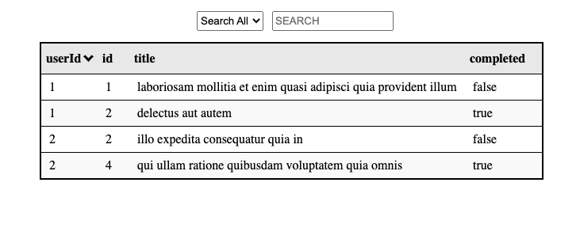
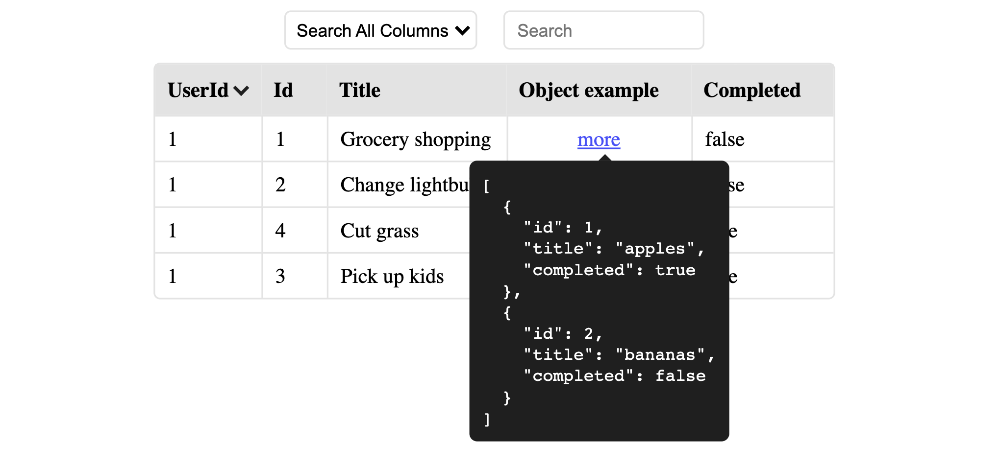

# RetracTable

<a href="https://github.com/sauerm1/RetracTable/workflows/Tests/badge.svg">

</a>

<!-- [](https://snyk.io/advisor/npm-package/retractable) -->

<!-- <a href="https://npmjs.com/package/RetracTable" target="\_parent">
  
</a> -->

<a href="https://npmjs.com/package/RetracTable" target="\_parent">
  
</a>

<!-- <a href="https://bundlephobia.com/result?p=retractable@latest" target="\_parent">
  
</a> -->

<a href="https://github.com/sauerm1/RetracTable/discussions">
  
</a>

<!-- <a href="https://github.com/sauerm1/RetracTable" target="\_parent">
  </a> -->

<br>
<br>
This project is a scalable, lightweight, zero dependency, responsive react.js table. All that you have to do is add a `Table` element and pass an array of objects to it as the `data` prop.
Robust features like sorting and searching are build in. Just give it a try.

<br>

## Get Started

```sh
npm i retractable
```

or

```sh
yarn add retractable
```

## Usage

```js
import React from "react";
import Table from "retractable";

const tasks = [
    { userId: 1, id: 1, title: "Grocery Shopping", completed: false },
    { userId: 1, id: 2, title: "Change lightbulb", completed: false },
    { userId: 1, id: 3, title: "Pick up kids", completed: true },
    { userId: 1, id: 4, title: "Cut grass", completed: true },
];

const App = () => {
    return <Table data={tasks} />;
};

export default App;
```

### This will produce a table like so...



<br>

### Nested data is now supported!



<hr>
<br>
<br>

# Props

| Prop Name                       | Required | Default | Usage                                       |
| ------------------------------- | -------- | ------- | ------------------------------------------- |
| [data](#data)                   | True     |         | [See `data` below](#data)                   |
| [capitalize](#capitalize)       | False    | False   | [See `capitalize` below](#capitalize)       |
| [excludeSearch](#excludeSearch) | False    | False   | [See `excludeSearch` below](#excludeSearch) |
| [onRowClick](#onRowClick)       | False    | False   | [See `onRowClick` below](#onRowClick)       |

<hr>
<br>

## `data`

This prop must contain an array of objects that you would like to make up your table.

-   required: `true`
-   default: `null`
-   options: `[{},{},...]`
-   usage:

```js
const people = [
    { name: "Mark", age: 25 },
    { name: "John", age: 52 },
];

const App = () => {
    return <Table data={people} />;
};
```

<br>

## `capitalize`

This prop will capitalize the first letter of each column header when set to true.

-   required: `false`
-   default: `false`
-   options: `true/false`
-   usage:

```js
return(
    <Table data={people} capitalize>
)
```

<br>

## `excludeSearch`

This prop will exclude the search feature from the table when set to true.

-   required: `false`
-   default: `false`
-   options: `true/false`
-   usage:

```js
return(
    <Table data={people} excludeSearch>
)
```

<br>

## `onRowClick`

Pass a function to the `onRowClick` prop and it will be executed when a row is clicked on. The row that is clicked on will be passed as an object to your function's first argument

-   required: `false`
-   default: `null`
-   options: `typeof function`
-   usage:

```js
const myCallbackFunction = (row) => {
    console.log(row); // returns: { userId: 1, id: 4, title: "Cut grass", completed: true }

    // do something with the row object here ...

};

return(
    <Table data={people} onRowClick={myCallbackFunction} >
)
```

<br>
