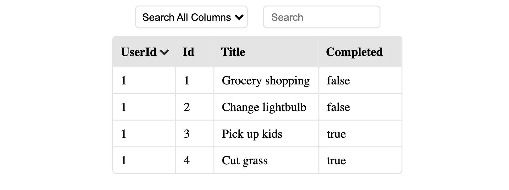

# RetracTable

This project is a scalable, lightweight, zero dependency, responsive react.js table. All that you have to do is create a `Table` element and pass an array of objects to it as the `data` prop.

Robust features like sorting and searching are build in. Just give it a try.

<br>

## Get Started

```sh
npm i retractable
```

## Usage

```js
import React from "react";
import Table from "retractable";

const people = [
    { name: "Mark", age: 25 },
    { name: "John", age: 52 },
];

const App = () => {
    return <Table data={people} />;
};

export default App;
```

### This will produce a table like so...



<br>

### Nested data is now supported!


<hr>
<br>
<br>

# Props

| Prop Name                       | Required | Default | Usage                                       |
| ------------------------------- | -------- | ------- | ------------------------------------------- |
| [data](#data)                   | True     |         | [See `data` below](#data)                   |
| [capitalize](#capitalize)       | False    | False   | [See `capitalize` below](#capitalize)       |
| [excludeSearch](#excludeSearch) | False    | False   | [See `excludeSearch` below](#excludeSearch) |

<hr>
<br>

## `data`

This prop must contain an array of objects that you would like to make up your table.

-   required: `true`
-   default: `null`
-   options: `[{},{},...]`
-   usage:

```js
const people = [
    { name: "Mark", age: 25 },
    { name: "John", age: 52 },
];

const App = () => {
    return <Table data={people} />;
};
```

<br>

## `capitalize`

This prop will capitalize the first letter of each column header when set to true.

-   required: `false`
-   default: `false`
-   options: `true/false`
-   usage:

```js
return(
    <Table data={people} capitalize>
)
```

<br>

## `excludeSearch`

This prop will exclude the search feature from the table when set to true.

-   required: `false`
-   default: `false`
-   options: `true/false`
-   usage:

```js
return(
    <Table data={people} excludeSearch>
)
```

<br>
